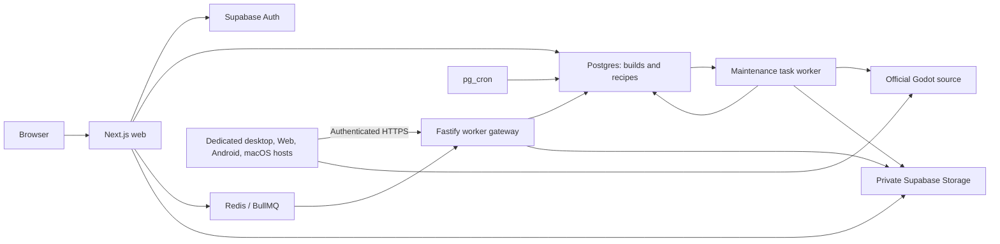

# Architecture and build lifecycle

min.gd uses npm workspaces and one shared build contract. The frontend does not
compile Godot; isolated workers consume validated recipes.

Production uses [distributed HTTPS workers](distributed-workers.md): the gateway
holds Redis/Supabase credentials on the application host, while dedicated build
hosts receive individual enrollment tokens. Direct workers remain available for
local development and rollback.

## Code ownership

| Directory | Responsibility |
| --- | --- |
| `apps/web` | App Router UI, cookie sessions, account/admin checks, submission/download routes |
| `packages/build-config` | Schemas, normalization, presets, releases, SCons mappings, cache identity, files, comparisons |
| `services/builder` | Remote/direct worker entrypoints, source verification, compilation, packaging, maintenance |
| `services/worker-gateway` | Private queue orchestration, enrollment, HTTPS assignments/heartbeats/telemetry, validated upload and recovery |
| `packages/worker-protocol` | Strict versioned HTTP contract |
| `supabase/migrations` | Reproducible schema, access policies, Storage, scheduled SQL |
| `supabase/tests` | pgTAP checks for constraints and authorization |
| `scripts` | Admin bootstrap, reference measurements, compiler/source audits |

Both consumers import `@mingd/build-config`. Its exports/import strategy must work
under Next.js/Turbopack and Node/tsx. Keep semantic choices there rather than
creating independent frontend and worker contracts.

## Request to download

1. Web checks account access/submission settings, validates and normalizes input,
   and resolves the exact official source URL/SHA-256.
2. It computes the canonical hash. An eligible cached artifact completes the
   user-owned build through reuse; otherwise it records the queued build and
   sends its ID and validated recipe to the platform queue.
3. The gateway revalidates configuration, release and hash, reconciles missing
   deliveries, and claims a durable lease for a compatible enrolled worker. The
   remote worker independently validates the assignment before compiling.
4. It verifies source, creates an isolated attempt workspace, generates allowlisted
   SCons arguments, and compiles requested kinds/architectures.
5. It validates structure, packages the TPZ, computes integrity/size metadata,
   streams it to the gateway. The gateway revalidates package integrity/ownership,
   uploads an immutable object and atomically records the artifact and completion.
6. Download authorization checks ownership or SuperAdmin access before issuing
   a short-lived signed URL for private Storage.

Completion requires a validated, uploaded artifact and recorded metadata.
Heartbeats and sanitized output are persisted. See [workbench](workbench.md) and
[queue recovery](accounts-and-admin.md#queue-recovery).

## Cache identity

Current build recipe version **9** is defined in
[`recipe.ts`](../packages/build-config/src/recipe.ts). SHA-256 input includes
recipe version, exact source URL/checksum, and canonical normalized settings:
version, platform, architecture, kinds, optimization, Web threads, and features.
Android adds its pinned toolchain recipe; macOS adds its platform recipe and
operator archive digest.

Equivalent recipes share internal artifacts while user-owned build metadata
remains authorized separately. Dry-run identities are separate from real builds.
Artifact reuse skips compilation; ccache reuse helps compile a different recipe.

Output, flags, packaging, or toolchain changes affecting equivalence require a
recipe identity bump. Desktop system packages are not all pinned; assess changed
toolchains when rebuilding. Deploy web and workers together when identity changes.

## Release discovery

The shared catalog discovers official stable Godot 4 releases from 4.5 onward
from `godotengine/godot-builds`, requiring an official source URL and SHA-256.
Each process caches success for one hour. Failure retains verified entries or
uses pinned 4.7.2/4.6.3 fallback entries, marks data stale, and retries in one minute.
The requested patch version is never silently substituted.

Maintenance separately persists the verified catalog and fills official-template
measurements. Its daily cron does not replace web/worker hourly discovery.
Android/macOS stay limited to their exact version allow-list even when newer
releases appear. See [profiles](build-profiles.md) and [maintenance](maintenance.md).

## Authorization and execution

Builds/private recipes use ownership checks and RLS. Protected `account_roles`,
not user-editable Auth metadata, determines admin access. Artifact/maintenance
records are backend-managed. Storage is private; shared recipes do not grant
downloads.

Privileged keys stay server-side. Input cannot specify repositories, patches,
commands, compiler flags, `custom.py`, or paths. Compiler orchestration does not
use shell execution. Workers mount neither Docker socket nor host root, and
attempts use isolated workspaces.

Workers validate archive structure and integrity. Test exported games using
[smoke tests](smoke-tests.md).
