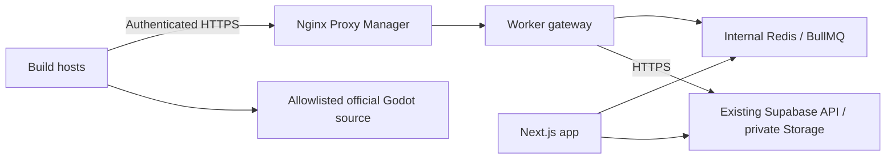

# Distributed workers: plan and implementation status

This is the agreed implementation direction, not deployment instructions for an
available gateway. The current production entry point still uses BullMQ and
privileged Supabase access directly. Remote HTTPS workers are not available yet.

## Deployment constraints

The production application Compose stack currently sits behind Nginx
Proxy Manager at `https://mingd.voidmoose.net`, and a separate Supabase stack
behind Nginx Proxy Manager at `https://supabase.voidmoose.net`. Cloudflare DNS
records resolve to private network IPs. Preserve these addresses, public trust
for HTTPS certificates, and private network reachability. No VPN or public-IP
switch is part of this rollout. Workers must be able to route to the proxy's
private address; DNS does not provide that connectivity.

The configured worker gateway endpoint is `https://worker.mingd.voidmoose.net`,
using a separate NPM proxy host. Keep its DNS pointed at the proxy's private
address. Existing certificate automation can
continue; DNS-01 supports publicly trusted certificates for private services.
NPM must reach the gateway through an explicitly shared Docker network or a
restricted host port, depending on where the proxy runs. Neither Redis nor
worker container ports become public endpoints.

## Target architecture



The gateway owns queue processing, assignment ownership, state transitions,
artifact publication and privileged backend credentials. Remote workers own
source verification, isolated compilation, structural validation and packaging.
They initiate outbound HTTPS requests and have no Redis credentials or Supabase
secret key. The shared build contract remains authoritative. The repo is already
an npm-workspaces monorepo; this extends its existing structure.

The ownership foundation now lives in `services/worker-gateway` and
`packages/worker-protocol`. The Fastify listener is runnable for health checks;
remote build processing is not wired in yet.
`compose.workers.yml` is still planned. Keep compilation in `services/builder` initially. Avoid
extracting another package until a second consumer actually requires it.

## Version targets

The current application version is **0.1.1**, the distributed-worker foundation
milestone. Complete distributed workers target **0.2.0**, after the remote-worker
acceptance gates below pass. Intermediate releases add capabilities while the
existing direct workers continue to serve production. A manifest version does
not mean images have been published or production has been upgraded.

| Application release | Implementation milestone | Status |
| --- | --- | --- |
| **0.1.1** | Compiler separation, shared v1 schemas, credential helpers, durable assignment leases, and Fastify gateway listener | Implemented foundation; listener reports `acceptingAssignments: false` |
| **0.1.2** | Worker enrollment, authentication, rotation/revocation, idle heartbeats, and operator visibility | Planned |
| **0.1.3** | Gateway queue integration, HTTPS assignments/build heartbeats, remote worker loop, cancellation, and worker-only deployment with resource budgets | Planned |
| **0.1.4** | Artifact uploads, validated completion, failure handling, bounded retries, and recovery | Planned |
| **0.2.0** | Validated multi-host distributed builds, failure testing, and documented production cutover/rollback | Target release; requires production acceptance |

Web, gateway, workers, and shared workspace packages use the same application
version and immutable image release tag (for example `v0.1.1`). The milestones
are delivery gates rather than promised dates; each release must satisfy its
scope before advancing.

### Runtime and compatibility policy

These versions describe implementation compatibility, separately from the
application release milestones above.

| Layer | Initial target / policy |
| --- | --- |
| Application release | Current 0.1.1 foundation; complete distributed workers target 0.2.0 |
| Worker HTTP protocol | v1 schemas implemented; proposed `/v1/` routes; explicit version negotiation before assignment |
| Build recipe | Existing recipe 9; bump only for changes affecting produced artifact equivalence |
| Database | New source-controlled migrations; schema versioning follows migration history |
| Container Node runtime | Existing Node 22 / Debian Bookworm baseline; no toolchain upgrade in this work |
| Repository operator Node | 24.21.0, as pinned by `.nvmrc` |
| BullMQ | Lockfile 6.3.11 (manifest `^6.3.10`); preserve initially |
| ioredis | Lockfile 6.0.0; preserve initially |
| Supabase JavaScript client | Lockfile 2.117.2; preserve initially |
| Queue Redis | Existing Redis 8 major; select a tested patch/digest before the distributed release |
| Next.js | Lockfile 16.3.8; no framework changes needed for initial compiler separation |
| Gateway HTTP server | Fastify 5.12.5, pinned exactly; Node 22 baseline |
| NPM / Supabase server | Preserve owner-managed installations; their exact deployed versions have not been inspected |

Protocol version, product release and recipe version serve different purposes.
A worker must match the supported protocol, platform/toolchain identity and build
recipe before receiving work. Initially require matching application release
tags as well. Future mixed-release support requires explicit compatibility tests.
Record exact image digests for release reproducibility; existing Node and Redis
tags are floating and do not establish a tested patch version.

Retain the existing platform toolchains: Emscripten 4.0.11 with its pinned image
digest, Android NDK 29.0.14206865 / SDK 36 / build-tools 36.1.0, and the verified
operator-supplied macOS SDK 27.0 archive. This plan does not change Godot flags,
supported versions or artifact/cache semantics.

## Worker protocol and ownership

1. Authenticate with a unique, revocable worker credential, stored hashed on the
   server. Restrict supported platforms and maximum active assignments centrally.
2. Request compatible work. Issue a unique attempt/assignment identity and
   expiring lease; never send client-selected commands, URLs or paths.
3. Report activity every ten seconds, preserving existing stage, sanitized log,
   output and performance fields. The gateway timestamps receipt. Track idle
   worker health separately from build activity.
4. Upload through an authorized, bounded streaming path. Prefer gateway upload
   initially so workers need no privileged Storage credential. Restrict size,
   concurrency, temporary disk usage, filename/path generation and timeouts.
5. Validate the artifact, commit immutable Storage identity and metadata, then
   record completion. Queue completion alone never establishes build success.

Every mutation must check worker identity, assignment identity and current lease.
Use atomic ownership checks for heartbeat, failure and completion. An expired or
superseded attempt cannot renew ownership or publish a result. Recheck ownership
when committing completion, including uploads that began before expiry. Define
cleanup for abandoned uploads and retries.

BullMQ lock renewal belongs to the gateway; remote assignment renewal is a
separate mechanism. Define retry/timeout behavior for each. If a worker disappears,
expire its assignment and recover according to bounded retry policy. If the
gateway restarts, outstanding assignments must be recoverable or invalidated
durably; an in-memory promise is not sufficient. Preserve terminal build states.
Workers must stop abandoned compilation; introduce cancellation and process-group
termination as part of the remote execution milestone.

Authentication includes credential rotation/revocation, bounded request bodies,
rate limits, secret redaction and platform permissions. Private reachability is
not authorization. Cache writes must also be restricted to trusted workers.

## Milestones and acceptance

### 1. Compiler foundation — implemented

- Separate local compiler configuration from privileged orchestration settings.
- Inject local runtime settings into compilation and source-cache access.
- Verify compiler import and dry-run packaging without Redis/Supabase credentials.
- Preserve the current direct-worker entry point and environment defaults.

This creates an integration boundary; it is not a distributed deployment.

### 2. Gateway and remote worker — in progress

Implemented foundation:

- Shared strict v1 schemas for worker negotiation, assignment and heartbeat.
  Unknown compiler inputs, nested feature fields and client-selected lease times
  are rejected. Diagnostic bodies have a planned 64 KiB HTTP limit and a 12,000
  character log-tail limit; Fastify now enforces the HTTP body limit.
- Per-worker 256-bit random credentials and server-side SHA-256 hashes. Credential
  parsing alone is not authentication; ownership RPCs verify enrollment each time.
- Backend-only, RLS-enabled worker registry and durable assignment tables in
  `20261008023352_worker_assignments.sql`. RPCs claim, renew and release assignments
  atomically, using server time and a 90-second lease (bounded to 30–300 seconds).
- Claims enforce release/recipe/target/toolchain identity and enrolled capacity.
  Disabled workers cannot renew; draining workers can finish current assignments
  but cannot claim new work. Credential rotation invalidates the previous token.
- Gateway database adapter requires matching release and recipe declarations.
  Lease replacement gets a fresh identity; expired/released attempts cannot renew.
- Fastify listener defaults to port 3001, with liveness at `/healthz`, safe error
  responses, request/body limits, structured logging and graceful shutdown.
  It currently reports `acceptingAssignments: false`. No worker operations are
  exposed through HTTP yet.
- SQL tests cover client privileges, RLS, capacity, replacement, expiry, revocation
  and terminal-state protection. These are not multi-host fault-injection tests.

Remaining for this milestone:

- Add credential enrollment/rotation/revocation tooling and idle-worker heartbeat.
- Move queue/database orchestration behind the gateway.
- Implement HTTPS assignment, heartbeat, failure, upload and completion handling.
- Add remote entry point and worker-only Compose with explicit resource budgets.
- Add operator enrollment/revocation/draining and minimum worker visibility.

There is no queue adapter, artifact completion RPC or remote worker loop yet.
Release only relinquishes a lease; it does not declare success
or requeue work. Those transitions need coordinated queue recovery. Existing
direct workers do not use these tables, and the new schema alone does not enable
distributed execution.

## Listener prototype and Nginx Proxy Manager

Run `npm run dev:worker-gateway` from the repo root to load root `.env` through
the existing dotenv CLI. The workspace `start` command reads exported environment
variables directly. Local defaults are `127.0.0.1:3001`. For the opt-in container:

```bash
npm run compose:worker-gateway:build
curl http://127.0.0.1:3001/healthz
```

This starts only the listener prototype, not distributed build processing. It is
included in `images:*:all` commands; commands without `:all` exclude it.
`images:up:all` starts every profile, including this prototype. No Redis or Supabase secrets are needed by the
health-only entry point yet.

The container listens on `0.0.0.0:3001`; Compose publishes host port
`WORKER_GATEWAY_PORT` (default 3001) on `WORKER_GATEWAY_BIND_IP` (default loopback).
`WORKER_GATEWAY_LOG_LEVEL` defaults to `info`. Local npm also accepts
`WORKER_GATEWAY_HOST`; Compose overrides it for container reachability.

If NPM shares the Compose network, forward HTTP to `worker-gateway:3001` and
omit the host publication in the deployment configuration. Otherwise bind the
host port to the application's private interface and forward NPM to that IP
and port. Restrict access to the NPM host using Docker-aware firewall rules.
NPM terminates HTTPS for `worker.mingd.voidmoose.net`; Redis remains internal.
Fastify does not trust forwarded headers initially; restrict trusted proxy
addresses explicitly before any feature relies on forwarded client addresses.

`/healthz` checks listener liveness only, not queues, assignment readiness or
Supabase connectivity. Upload-specific size/time limits and worker-authenticated
routes remain part of the next implementation step.

Once the listener is deployed and NPM forwarding is configured, check
`https://worker.mingd.voidmoose.net/healthz` from a build host. The prototype
returns `status: "ok"`, `protocolVersion: 1`, and `acceptingAssignments: false`.
This verifies the HTTPS path to the listener; distributed execution remains
pending.

### 3. Recovery and production rollout — planned

- Test disconnect, worker crash, gateway restart, expired/replaced assignments,
  credential revocation, duplicate completion and interrupted uploads.
- Reset/test local Supabase with new migrations and authorization checks.
- Exercise two hosts and NPM routing with existing private DNS/trusted HTTPS.
- Run a real build, verify progress/heartbeats and authorized private download,
  then perform platform-specific export/runtime acceptance separately.
- Drain direct workers before queue ownership cutover; do not allow both modes to
  compete for the same queues during rollout. Keep documented rollback rules for
  in-flight leases and schema compatibility.

Shared Redis compiler caching, pending-recipe deduplication, autoscaling and
distributed compilation of a single build are later work. Initially retain local
compiler caches. A gateway-only worker cannot directly use a private Redis cache;
choose a restricted cache transport separately before that rollout.

## References

- [Current architecture](architecture.md), [deployment](deployment.md) and [performance](performance.md)
- [BullMQ stalled jobs](https://docs.bullmq.io/guide/workers/stalled-jobs)
- [DNS-01 certificate validation](https://letsencrypt.org/docs/challenge-types/#dns-01-challenge)
