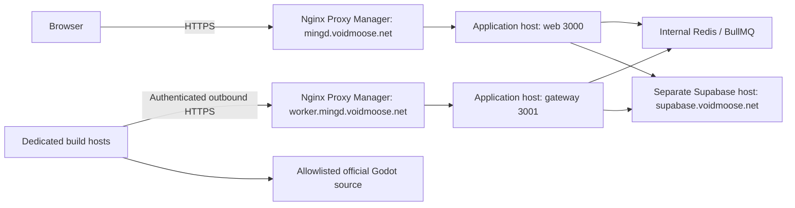

# Distributed workers

Release **0.2.1** includes the HTTPS gateway and remote workers introduced in 0.2.0,
plus improved failure diagnostics. Production uses
separate application and build hosts. Redis stays inside the application Compose
network; build hosts receive individual worker credentials and no privileged
Supabase key. No VPN, public-IP change or new backend platform is required.

## Production topology



Cloudflare DNS may continue resolving these hostnames to private addresses.
Workers need a route to those addresses. Existing publicly trusted HTTPS
certificates remain appropriate; workers require verified HTTPS and reject
redirects. They expose no listener. NPM forwards HTTP to the application host's
port **3001**, or `worker-gateway:3001` on a shared Docker network. Compose publishes
the port without requiring a host-IP environment variable. Restrict upstream
reachability to the proxy through your existing Docker-aware firewall rules.

The repo is an npm-workspaces monorepo. `packages/build-config` owns build
semantics; `packages/worker-protocol` owns strict HTTP schemas;
`services/worker-gateway` runs Fastify and privileged orchestration;
`services/builder` runs isolated compilation with either `BUILDER_MODE=remote`
or the retained direct mode for local development/rollback.

## Release milestones and compatibility

| Version | Capability delivered |
| --- | --- |
| 0.1.1 | Compiler boundary, protocol schemas, durable assignment ownership, Fastify listener |
| 0.1.2 | Enrollment, authentication, rotation/revocation, idle heartbeats, operator listing |
| 0.1.3 | Queue dispatch, remote compilation, build heartbeats, cancellation, worker deployment |
| 0.1.4 | Streaming uploads, validated completion, retries and durable recovery |
| **0.2.0** | Combined distributed implementation, local acceptance tests and production runbook |
| **0.2.1** | Worker failure reasons and final diagnostics, source/copy output, and extraction capability troubleshooting |

These describe implementation gates, not claims that every intermediate image
was published. All workspace manifests now use **0.2.1**. Deploy web, gateway
and workers from the same immutable release tag. Exact application release,
protocol **v1**, recipe **9**, target and macOS toolchain identity must match
worker enrollment before assignment. Re-enroll identities when changing release
or capabilities; rotating a token only changes its secret. Do not overwrite an
already published release tag. Previously published `v0.1.2` images are historical
and do not contain this completed transport.

Container Node remains **22 / Debian Bookworm**; operator Node is **24.21.0** via
`.nvmrc`. Fastify is exactly **5.12.5**. The lockfile retains BullMQ **6.3.11**,
ioredis **6.0.0**, Supabase JS **2.117.2** and Next.js **16.3.8**. Redis retains the
existing **8** major image policy. Record image digests when publishing; floating
base tags do not establish reproducible patch versions. No Godot compiler flags,
source identities or platform toolchain semantics changed in this release, so
recipe 9 remains valid. NPM and production Supabase remain owner-managed.

## Authentication and operator controls

Apply migrations from an authorized matching checkout first; see
[database deployment](deployment.md#database-migrations). The new migrations are
`20261008023352_worker_assignments.sql`, `20261008041647_worker_heartbeat.sql`, and
`20261008043446_distributed_execution.sql`. They add private RLS-protected worker,
assignment and upload records, atomic ownership RPCs and upload cleanup.

Enrollment is an operator command using server-only Supabase access. No public
HTTP enrollment/admin endpoint exists. Relative credential-file paths resolve from
the directory where you invoke npm, including workspace commands. Create a
private output directory first:

```bash
mkdir -m 700 worker-tokens
npm run workers -- enroll --name buildhost01-desktop --target desktop --credential-file worker-tokens/desktop.token
npm run workers -- enroll --name buildhost01-web --target web --credential-file worker-tokens/web.token
npm run workers -- list
```

Enroll only targets you intend to start. Android uses `--target android`; macOS
uses `--target macos --toolchain-sha256 <verified-image-digest>`. Enrollment defaults
to capacity 1; `--capacity` supports 1–16 and must cover the worker's configured
`BUILDER_CONCURRENCY`. Each process/container gets its own identity. Transfer only
its token file to the worker host through your secure transfer method. Tokens are
256-bit secrets, stored only as SHA-256 hashes server-side; output files are new,
mode 0600, never printed, and `worker-tokens/` is gitignored.

```bash
npm run workers -- drain --id <worker-id>
npm run workers -- resume --id <worker-id>
npm run workers -- rotate --id <worker-id> --credential-file worker-tokens/desktop-new.token
npm run workers -- revoke --id <worker-id>
npm run workers -- enable --id <worker-id>
```

Draining allows active work to finish and blocks new claims. Rotation/revocation
immediately invalidates the old token and interrupts active assignments; drain
first for planned rotation, replace the mounted token and recreate that worker.
`enable` reverses revocation; `resume` reverses draining. An ambiguous database
transport failure may still have committed enrollment/rotation: the CLI preserves
the output file for recovery. Inspect `list` before retrying with a new file.

For a one-shot authenticated check from a matching checkout:

```bash
npm run probe --workspace @mingd/worker-gateway -- --gateway https://worker.mingd.voidmoose.net --credential-file worker-tokens/desktop.token --target desktop
```

The worker process itself polls continuously; the probe is optional. `list` exposes
last-seen, enrolled capacity, release and drain/revoke state without credentials.

## Assignment and build lifecycle

The gateway consumes the existing four BullMQ queues, validates the database/queue
owner, normalized recipe, official release and canonical hash, and holds queue
ownership while remote compilation proceeds. Workers poll compatible work and
independently revalidate the recipe/hash against the official catalog. Assignments
contain validated configuration and server-generated IDs, never arbitrary source
URLs, commands, flags or filesystem paths.

Each delivery has a database-owned **90-second lease**. Active workers send stage,
bounded sanitized logs, output bytes and performance measurements every **10
seconds**. The gateway timestamps receipt and renews ownership atomically. Worker
idle health remains separate and cannot renew a build lease. Workers use a
conservative monotonic timeout to stop compilation after lost connectivity;
expired, revoked and superseded attempts cannot publish or restart terminal builds.
Cancellation kills compiler process groups, including descendants.

The gateway retains BullMQ lock renewal separately from the remote lease. It
reconciles missing queue deliveries and exhausted jobs. Queue attempts use the
submitted retry policy (normally two); recovered jobs get two attempts. Lease
loss rejects the current queue delivery; retries use fresh assignment IDs. A
restart invalidates the prior assignment when BullMQ redelivers the recovered
job. Graceful shutdown rejects pending deliveries. Crashed delivery recovery
includes BullMQ's lock expiry/stalled interval, so it is not instantaneous.

Initial production runs **one gateway instance**. Pending queue deliveries are
owned by that instance; adding gateway replicas behind round-robin routing is not
supported. Worker hosts scale horizontally with independent enrollments and
local caches. Worker containers retain only CHOWN, DAC_OVERRIDE and FOWNER
capabilities to read host-owned private token files and preserve source metadata;
all other capabilities are dropped and privilege escalation is disabled. They
mount only their token and dedicated source/cache/work volumes. Each target can hold up to `WORKER_GATEWAY_QUEUE_CONCURRENCY`
pending queue deliveries (default 16, maximum 64). This is dispatch capacity,
not compiler thread count. Limit worker concurrency/CPU to the host's budget.

## Artifact publication and recovery

Workers stream TPZ uploads through the gateway, including content length and
SHA-256. The gateway authenticates assignment ownership before reading bytes,
spools into a private temporary directory, verifies checksum and bounded archive
structure, then uploads to private Supabase Storage. Nested templates undergo
platform-specific structural checks; workers cannot provide Storage paths or
artifact metadata to the completion transaction. Runtime/export acceptance
remains a separate test.

Uploads are limited to **512 MiB**, **two concurrent uploads** by default (maximum
four), a **five-minute receive timeout**, **30-second idle timeout**, and bounded
archive validation (two GiB decompressed work, 20,000 entries, two minutes).
Temporary files are removed after requests and on gateway startup. Reserve enough
application-host disk for concurrent uploads and nested validation; this uses disk,
not a Redis compiler cache. The gateway container has a 512 MiB memory limit and
one CPU by default. Build workers retain separate source, ccache and work volumes.

Completion rechecks the current lease transactionally and records the immutable
artifact before marking the build complete. Duplicate completion returns the
committed result. If an upload response is lost, workers query authenticated
assignment status before retrying. Equivalent artifact races retain one winner;
unused objects are queued for deletion. A durable upload reservation precedes
Storage writes, and expired pending reservations become cleanup tombstones even
if the gateway crashes. The existing maintenance service performs deletions.
The upload ledger cleans pending objects after ten minutes, through gateway
polling and a five-minute cron. Published objects are retained.

## HTTP and resource settings

`/healthz` reports listener liveness and current assignment readiness. With worker
control disabled it needs no backend access. Set
`WORKER_GATEWAY_WORKERS_ENABLED=true` for authenticated control;
`WORKER_GATEWAY_EXECUTION_ENABLED=true` additionally requires private Redis and
starts dispatch. Both default false for safe migration/cutover. See
[configuration](configuration.md#distributed-worker-settings) for resource settings.

Control routes reject unknown fields, unsupported versions and oversized JSON
(64 KiB). Requests receive safe generic errors without backend details. Token
parsing is followed by database authentication; private network reachability alone
is not authorization. JSON polling returns 401 for invalid/revoked credentials,
409 for incompatible enrollment, 400 for malformed input and 503 when dispatch
is unavailable. Assignment mutations return 410 for lost ownership. Upload
capacity returns 429, allowing bounded retries while the lease is live.

Each route group has a bounded in-process pre-authentication budget of 600 requests
per minute per socket peer, with at most 4096 peers. Fastify does not trust forwarded
headers, so workers behind the same NPM peer share that budget. This limits a single
gateway's requests; global rate limiting and gateway replication are future work.

## Troubleshooting interrupted builds

Worker logs include the assignment ID, compiler stage and sanitized reason in
`worker_build_interrupted`. For a live assignment, the worker sends its final
bounded output and failure reason before reporting failure. Source download,
extraction and workspace copy errors are included in that output, as well as
compiler errors. Lost ownership or connectivity can prevent this final heartbeat;
check the worker log in those cases. Gateway recovery can report a generic
delivery failure, so that message alone does not establish a network problem.

A build that stops at `verifying_source` has not started compilation. Check its
worker reason and bounded output for checksum, archive extraction, filesystem
permission or disk-space errors before changing compiler resource settings.

`tar: Cannot change ownership ... Operation not permitted` with `CapEff: 0` means
the deployed worker has dropped the capabilities required by source extraction.
The shared worker block in `compose.workers.prod.yml` uses `cap_drop: [ALL]` with
`cap_add: [CHOWN, DAC_OVERRIDE, FOWNER]`: ownership and metadata preservation are
needed for official source archives/copies, and the worker must read host-owned
mode-0600 credentials. Keep those settings when copying the Compose file to a
worker host. Recreate an idle affected container after updating its Compose file
(`docker compose up -d --force-recreate builder` for the desktop worker); restarting
an existing container does not apply new capability settings. No image rebuild or
credential re-enrollment is needed for that deployment correction.

## Validation and production acceptance

Repository tests cover protocol boundaries, credential operations, queue/lease
adapters, process cancellation and package validation. SQL/RLS tests cover ownership,
capacity, expiry/replacement, terminal states, upload publication and cleanup.
The optional local integration runner uses real HTTPS with an ephemeral test CA,
two credential-only worker processes, local Redis/Supabase, dry-run packaging,
streamed uploads, integrity verification, cache reuse, missing-delivery repair,
expiry, gateway restart and revocation:

```bash
MINGD_INTEGRATION_REDIS_URL=redis://127.0.0.1:16379 node --import tsx services/worker-gateway/integration/distributed.ts
```

Use a disposable local Redis database and a running local Supabase stack. The
runner creates/removes its own users, builds, workers and artifacts. Set
`MINGD_INTEGRATION_WORKER_IMAGE` to a newly built desktop image to run workers in
separate Node 22 containers instead of host processes; each gets only its own token
and test files. It does not
compile Godot or prove physical multi-host/native acceptance. CLI 2.119.0 is used
for local database validation because installed 2.120.0 failed during base-schema
initialization; application migrations are source controlled.

Local validation has passed workspace typechecks/tests, 258 SQL checks, database
function lint, web/maintenance/gateway/desktop image builds, the gateway tests on
Node 22, and the HTTPS integration flow with host processes and two isolated
Node 22 worker containers. Those integration builds use diagnostic source fixtures
and dry-run archives, not compiled templates.

The owner has verified production HTTPS `/healthz` through NPM. Production remote
builds and fault recovery still need the [cutover acceptance steps](deployment.md#distributed-cutover-and-rollback).
Shared remote compiler caching, pending-recipe deduplication, autoscaling,
gateway replication and distributed compilation of a single build remain later work.
