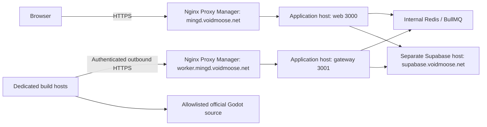

# Distributed workers

Production uses an HTTPS gateway and credential-only remote workers. This guide
covers their topology, compatibility, enrollment, protocol and diagnostics.
[Deployment](deployment.md) owns publication and production update commands;
[worker release history](../archive/worker-release-history.md) preserves older rollout notes.

## Production topology



The hostnames above are deployment examples matching the checked-in settings.
Use your own reachable app, gateway and Supabase addresses. Private DNS/TLS is
supported; workers need a route to the gateway. Use trusted HTTPS certificates; workers require verified HTTPS and reject
redirects. They expose no listener. NPM forwards HTTP to the application host's
port **3001**, or `worker-gateway:3001` on a shared Docker network. Compose publishes
the port without requiring a host-IP environment variable. Restrict upstream
reachability to the proxy through your existing Docker-aware firewall rules.

The repo is an npm-workspaces monorepo. `packages/build-config` owns build
semantics; `packages/worker-protocol` owns strict HTTP schemas;
`services/worker-gateway` runs Fastify and privileged orchestration;
`services/builder` runs isolated compilation with either `BUILDER_MODE=remote`
or the retained direct mode for local development/rollback.

## Release compatibility

Deploy a tested set of compatible web, gateway and worker images. Each service
keeps its own immutable image tag; the root package version does not select the
whole deployment. The [deployment guide](deployment.md#build-here-pull-on-production-ghcr)
owns the release, publication and production update commands.
Existing worker IDs and credentials survive routine application upgrades.
Compatibility requires protocol **v1**, recipe **10**, the enrolled target, and
macOS toolchain identity. Changing a recipe, target, or toolchain requires a
matching enrollment; token rotation changes only the secret. The bulk `upgrade`
command updates drained enrollment to the checkout's recipe/release and rotates
credentials while preserving worker IDs.

A recipe-version change requires new web, gateway and every deployed compiler
image, even if the gateway's own source files did not change. Each embeds the
shared recipe at build time. Web hashes submissions with it; the gateway checks
it before assigning work; workers declare and verify it. An old gateway recipe
returns HTTP 409 to otherwise authenticated new workers. Update enrollment and
deploy the new gateway before starting/resuming the new workers, following the
[compiler rollout checklist](deployment.md#compiler-recipe-and-toolchain-upgrade-checklist).

Bump the protocol for incompatible HTTP changes and the recipe when binary
inputs or packaging change. Keep published release tags immutable. See
[worker release history](../archive/worker-release-history.md) for earlier rollout details.

Worker containers use Node 24 / Debian Bookworm. Use `.nvmrc` for the operator
runtime and `package-lock.json` for exact application dependencies. Record image
digests when publishing because base tags can change.

The current compiler recipe is **10**, including the digest-pinned Emscripten
6.0.11 toolchain. Recipe 9 enrollment is incompatible with it. Use the
[compiler rollout procedure](deployment.md#compiler-recipe-and-toolchain-upgrade-checklist)
when changing recipe/toolchain identities. Application and image versions are
independent of the protocol and recipe numbers.

## Authentication and operator controls

Apply migrations from an authorized matching checkout first; see
[database deployment](deployment.md#database-migrations). Worker support uses
`20261008023352_worker_assignments.sql`, `20261008041647_worker_heartbeat.sql`,
`20261008043446_distributed_execution.sql`,
`20261008070551_worker_release_compatibility.sql`, and
`20261008071856_worker_telemetry.sql`. They add private RLS-protected worker,
assignment and upload records, atomic ownership RPCs, upload cleanup and
release-independent worker compatibility and private telemetry snapshots.

Enrollment is an operator command using server-only Supabase access. No public
HTTP enrollment/admin endpoint exists. Relative credential-file paths resolve from
the directory where you invoke npm, including workspace commands. Create a
private output directory first:

```bash
mkdir -m 700 worker-tokens
npm run workers -- enroll --name buildhost01-desktop --target desktop --credential-file worker-tokens/desktop.token
npm run workers -- enroll --name buildhost01-web --target web --credential-file worker-tokens/web.token
npm run workers -- list
```

Enroll only targets you intend to start. Android uses `--target android`; macOS
uses `--target macos --toolchain-sha256 <toolchain-archive-sha256>`. Enrollment defaults
to capacity 1; `--capacity` supports 1–16 and must cover the worker's configured
`BUILDER_CONCURRENCY`. Each process/container gets its own identity. Transfer only
its token file to the worker host through your secure transfer method. Tokens are
256-bit secrets, stored only as SHA-256 hashes server-side; output files are new,
mode 0600, never printed, and `worker-tokens/` is gitignored.

```bash
npm run workers -- drain --id <worker-id>
npm run workers -- resume --id <worker-id>
npm run workers -- rotate --id <worker-id> --credential-file worker-tokens/desktop-new.token
npm run workers -- revoke --id <worker-id>
npm run workers -- enable --id <worker-id>
npm run workers -- drain --all --wait --timeout-seconds 43200
npm run workers -- upgrade --all --credential-dir worker-tokens/new-rollout
npm run workers -- rotate --all --credential-dir worker-tokens/new-rotation
npm run workers -- resume --all
```

Draining allows active work to finish and blocks new claims. Rotation/revocation
immediately invalidates the old token and interrupts active assignments; drain
first for planned rotation, replace the mounted token and recreate that worker.
`enable` reverses revocation; `resume` reverses draining. An ambiguous database
transport failure may still have committed enrollment/rotation: the CLI preserves
the output file for recovery. Inspect `list` before retrying with a new file.
Bulk operations select enabled workers; revoked workers are excluded. Bulk
credentials require every selected worker to be draining with no active durable
assignments. They write separate mode-0600 tokens and a private outcome manifest
inside a new mode-0700 directory. Stop drained workers before upgrading, transfer
each token to its corresponding host, recreate workers, verify heartbeats, then
resume. See the rollout checklist for image tags, macOS identities, and recovery.

For a one-shot authenticated check from a matching checkout:

```bash
npm run probe --workspace @mingd/worker-gateway -- --gateway https://worker.mingd.voidmoose.net --credential-file worker-tokens/desktop.token --target desktop
```

The worker process itself polls continuously; the probe is optional. `list` exposes
last-seen, enrolled capacity, release and drain/revoke state without credentials.

## Admin worker health and telemetry

SuperAdmins can view `/admin/workers`: authenticated last-seen status, target,
observed app/recipe versions, capacity, active assignments, drain/revoke state,
and compact resource readings. The overview pages through 25 workers at a time.
Open a worker's name or **Worker details** to visit `/admin/workers/<worker-id>`
for app/recipe information, compiler cache totals, container resources, active
assignments, and the latest build's recorded diagnostics. Both pages refresh
every ten seconds. This is read-only; enrollment and
rotation/drain/revoke remain operator CLI commands. The Metrics page labels
Redis access as **Queue available**, which does not establish worker health.

Workers send authenticated, bounded snapshots to `POST /v1/workers/telemetry`
every **30 seconds**, including while idle. This additive protocol-v1 endpoint
uses the same credential and capability checks as worker heartbeats. Gateway
receipt time is authoritative. Telemetry cannot renew an assignment lease or
change build activity. A worker disables this optional report when an older
gateway returns 404; it continues processing builds.

The page distinguishes Online (receipt within 45 seconds), Stale (45–90 seconds),
Offline (over 90 seconds or never seen), Draining, and Revoked. Snapshot age is
shown separately; readings older than 90 seconds remain visibly stale rather
than appearing current or becoming invented zeroes.

Ccache totals are cumulative per local cache volume: hits, misses, hit rate,
size, configured maximum, file count, version, and recorded reset time. Clearing
counters changes their baseline; containers sharing one volume report the same
cache. Per-build hit/miss deltas, usage verification, stage durations and measured
peak child RSS remain separate from these totals. An artifact-cache hit can skip
compilation entirely.

Resource samples report the worker container's private cgroup-v2 CPU usage/quota,
memory usage/limit and process/thread count, plus worker process uptime. CPU
cores in use need two samples. This does not measure the entire host; memory
includes what the kernel charges to the group. Unsupported/inaccessible cgroup
controllers and failed ccache measurements are unavailable. No additional
credentials, host mounts, Docker socket or environment settings are needed.

## Assignment and build lifecycle

The gateway consumes the existing four BullMQ queues, validates the database/queue
owner, normalized recipe, official release and canonical hash, and holds queue
ownership while remote compilation proceeds. Workers poll compatible work and
independently revalidate the recipe/hash against the official catalog. Assignments
contain validated configuration and server-generated IDs, never arbitrary source
URLs, commands, flags or filesystem paths.

Each delivery has a database-owned **90-second lease**. Active workers send stage,
bounded sanitized logs, output bytes and performance measurements every **10
seconds**. The gateway timestamps receipt and renews ownership atomically. Worker
idle health remains separate and cannot renew a build lease. Workers use a
conservative monotonic timeout to stop compilation after lost connectivity;
expired, revoked and superseded attempts cannot publish or restart terminal builds.
Cancellation kills compiler process groups, including descendants.

The gateway retains BullMQ lock renewal separately from the remote lease. It
reconciles missing queue deliveries and exhausted jobs. Queue attempts use the
submitted retry policy (normally two); recovered jobs get two attempts. Lease
loss rejects the current queue delivery; retries use fresh assignment IDs. A
restart invalidates the prior assignment when BullMQ redelivers the recovered
job. Graceful shutdown rejects pending deliveries. Crashed delivery recovery
includes BullMQ's lock expiry/stalled interval, so it is not instantaneous.

Initial production runs **one gateway instance**. Pending queue deliveries are
owned by that instance; adding gateway replicas behind round-robin routing is not
supported. Worker hosts scale horizontally with independent enrollments and
local caches. Worker containers retain only CHOWN, DAC_OVERRIDE and FOWNER
capabilities to read host-owned private token files and preserve source metadata;
all other capabilities are dropped and privilege escalation is disabled. They
mount only their token and dedicated source/cache/work volumes. Each target can hold up to `WORKER_GATEWAY_QUEUE_CONCURRENCY`
pending queue deliveries (default 16, maximum 64). This is dispatch capacity,
not compiler thread count. Limit worker concurrency/CPU to the host's budget.

## Artifact publication and recovery

Workers stream TPZ uploads through the gateway, including content length and
SHA-256. The gateway authenticates assignment ownership before reading bytes,
spools into a private temporary directory, verifies checksum and bounded archive
structure, then uploads to private Supabase Storage. Nested templates undergo
platform-specific structural checks; workers cannot provide Storage paths or
artifact metadata to the completion transaction. Runtime/export acceptance
remains a separate test.

Uploads are limited to **512 MiB**, **two concurrent uploads** by default (maximum
four), a **five-minute receive timeout**, **30-second idle timeout**, and bounded
archive validation (two GiB decompressed work, 20,000 entries, two minutes).
Temporary files are removed after requests and on gateway startup. Reserve enough
application-host disk for concurrent uploads and nested validation; this uses disk,
not a Redis compiler cache. The gateway container has a 512 MiB memory limit and
one CPU by default. Build workers retain separate source, ccache and work volumes.

Completion rechecks the current lease transactionally and records the immutable
artifact before marking the build complete. Duplicate completion returns the
committed result. If an upload response is lost, workers query authenticated
assignment status before retrying. Equivalent artifact races retain one winner;
unused objects are queued for deletion. A durable upload reservation precedes
Storage writes, and expired pending reservations become cleanup tombstones even
if the gateway crashes. The existing maintenance service performs deletions.
The upload ledger cleans pending objects after ten minutes, through gateway
polling and a five-minute cron. Published objects are retained.

## HTTP and resource settings

`/healthz` reports listener liveness and current assignment readiness. With worker
control disabled it needs no backend access. Set
`WORKER_GATEWAY_WORKERS_ENABLED=true` for authenticated control;
`WORKER_GATEWAY_EXECUTION_ENABLED=true` additionally requires private Redis and
starts dispatch. Both default false for safe migration/cutover. See
[configuration](configuration.md#distributed-worker-settings) for resource settings.

Control routes reject unknown fields, unsupported versions and oversized JSON
(64 KiB). Requests receive safe generic errors without backend details. Token
parsing is followed by database authentication; private network reachability alone
is not authorization. JSON polling returns 401 for invalid/revoked credentials,
409 for incompatible enrollment, 400 for malformed input and 503 when dispatch
is unavailable. Assignment mutations return 410 for lost ownership. Upload
capacity (including pending reservation limits after interrupted uploads) returns
429, allowing bounded retries while the lease is live. The 30-second transfer
idle timeout ends once the request body is received; it does not cover package
validation or publication to Storage. Gateway publication errors log a safe
operation category (`reservation`, `storage_upload`, `measurements`, or `commit`).

Each route group has a bounded in-process pre-authentication budget of 600 requests
per minute per socket peer, with at most 4096 peers. Fastify does not trust forwarded
headers, so workers behind the same NPM peer share that budget. This limits a single
gateway's requests; global rate limiting and gateway replication are future work.

## Troubleshooting interrupted builds

Worker logs include the assignment ID, compiler stage and sanitized reason in
`worker_build_interrupted`. For a live assignment, the worker sends its final
bounded output and failure reason before reporting failure. Source download,
extraction and workspace copy errors are included in that output, as well as
compiler errors. Lost ownership or connectivity can prevent this final heartbeat;
check the worker log in those cases. Gateway recovery can report a generic
delivery failure, so that message alone does not establish a network problem.

A build that stops at `verifying_source` has not started compilation. Check its
worker reason and bounded output for checksum, archive extraction, filesystem
permission or disk-space errors before changing compiler resource settings.

`tar: Cannot change ownership ... Operation not permitted` with `CapEff: 0` means
the deployed worker has dropped the capabilities required by source extraction.
The shared worker block in `compose.workers.prod.yml` uses `cap_drop: [ALL]` with
`cap_add: [CHOWN, DAC_OVERRIDE, FOWNER]`: ownership and metadata preservation are
needed for official source archives/copies, and the worker must read host-owned
mode-0600 credentials. Keep those settings when copying the Compose file to a
worker host. Recreate an idle affected container after updating its Compose file
(`docker compose up -d --force-recreate builder` for the desktop worker); restarting
an existing container does not apply new capability settings. No image rebuild or
credential re-enrollment is needed for that deployment correction.

## Validation and production acceptance

The optional HTTPS diagnostic integration runner and its coverage are described
in [development](../developers/development.md#distributed-integration-checks).
Use [smoke tests](../developers/smoke-tests.md) for compiled-template checks and
[deployment](deployment.md#distributed-cutover-and-rollback) for cutover.

Shared remote compiler caching, pending-recipe deduplication, autoscaling,
gateway replication and distributed compilation of a single build remain later work.
